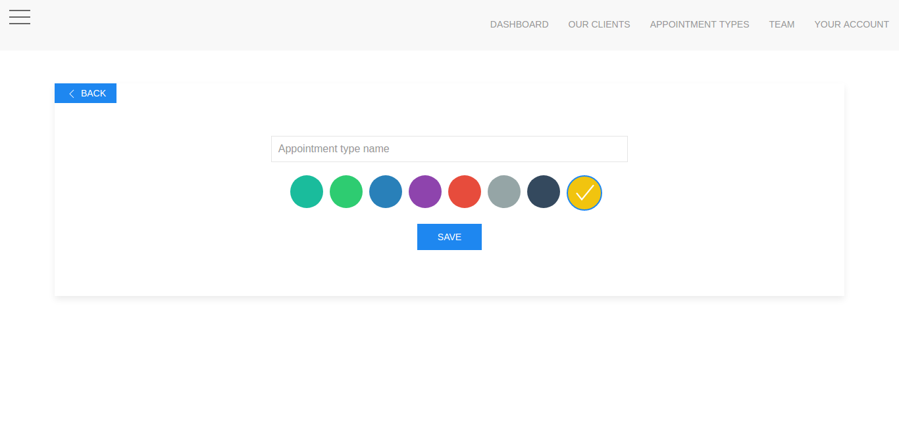

# Color-picker jquery plugin

TODO: display an awesome and simple color picker to use

## How to use it

1. Download files 
2. Add the javascript file in your html page
3. Add the html code structre in your html file 
4. Add how much color you want to display in your page using the data-color
4. call the plugin function

## Edit the style 

 You add the style you want and use the any other css framework you want

## Screen shot from a project in which i used this code

